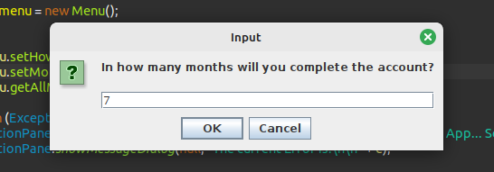
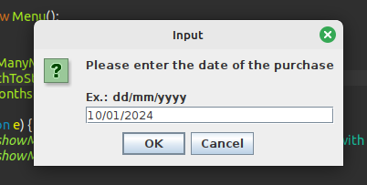
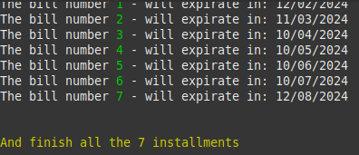

<head>
	<link rel="stylesheet" type="text/css" href="css/style.css" />
</head>

<h1 align="center">Returning to the origins</h1>

## 📖️ About
<p>This project aims to interact with the user, to present a certain period in which the estimated time of an account was entered and calculate this time for how long the installments will last.</p>

## 🤝️ Business rules
<p>Access the app, enter in how many months will the installments be, type the date of start counting and see the calculations of all months of the installments.</p>


<br/>
<p align="center" class="italic">Practical examples below</p>
<hr/>

<h3 align="center" class="green-title">First part of program interaction</h3>


<br/>

<h3 align="center" class="green-title">Second part of program interaction</h3>


<br/>

<h3 align="center" class="green-title">Third part of program interaction</h3>


<br/>
<hr/>

## 🔨 Tools

- [OS - Linux Mint](https://www.linuxmint.com/download.php)
- [Java 22.ea.26-open across sdkman](https://sdkman.io/install)
- [Eclipse](https://eclipseide.org/)

<br />
<hr />

## 📚 Libs
- javax.swing.JOptionPane;
- java.time.DayOfWeek;
- java.time.LocalDate;
- java.time.format.DateTimeFormatter.

```bash
	#Clone this project
    git clone https://github.com/giovanni0800/installments-calculator.git
```

## 📔️ License
This Project is under the MIT license. See the file LICENSE
for more details